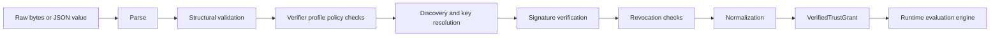

**Document Version:** 1.1\
**Last Updated:** 2026-07-14\
**Status:** Draft\
**Related Documents:** [TrustGrant Crate Docs](README.md),
[TrustGrant v0 Spec](TRUSTGRANT_V0_SPEC.md),
[TrustGrant Authority Discovery](TRUSTGRANT_AUTHORITY_DISCOVERY.md),
[TrustGrant Federation Flow](TRUSTGRANT_FEDERATION_FLOW.md),
[TrustGrant Interoperability and Proof Models](INTEROPERABILITY_AND_PROOF_MODELS.md),
[TrustGrant Type and Trait Design](TYPE_AND_TRAIT_DESIGN.md),
[TrustGrant Canonicalization Specialization](CANONICALIZATION_SPECIALIZATION.md),
SDD-017 TrustGrant Federation,
ADR-013 TrustGrant Protocol Boundary

# TrustGrant Implementation Architecture

## 1. Overview

This document defines the technical implementation shape of the `trustgrant` crate.

The crate is intended to implement the full TrustGrant v0 suite:
- document parsing
- structural validation
- cryptographic verification
- authority discovery handling
- delegated principal key resolution
- revocation status handling
- ownership-authority transition handling
- normalization into verified grant records
- evaluation of `recognize`, `mint`, and service-defined operations

The crate must remain runtime-agnostic and transport-agnostic so it can later be
extracted into its own repository and published independently.

## 2. Architectural Style

The `trustgrant` crate should be built as:
- **Domain-Driven Design**
  - protocol concepts such as grants, authorities, subjects, proofs, and evaluation
    decisions are first-class domain types
  - invalid protocol states should be made unrepresentable where practical
- **Hexagonal Architecture**
  - the core protocol domain owns parsing, validation, verification, normalization, and
    evaluation
  - external concerns such as HTTP discovery, chain resolvers, caches, persistence, and
    proof-bundle loading are adapters outside the core
- **Feature-oriented protocol slices**
  - the crate should be organized around protocol capabilities and lifecycles such as
    document handling, discovery, revocation, verification, and evaluation
  - avoid service/controller/repository layering inside the crate

This means the crate should feel like a protocol engine with explicit ports, not like a
web application split into technical layers.

## 3. Design Goals

- implement the full TrustGrant v0 protocol surface
- keep the crate independent from HTTP servers, database adapters, and event-streaming
  adapters
- support online, cached, and offline verification postures
- make hot-path evaluation operate on normalized verified state, not on repeated
  full-document verification
- make illegal states unrepresentable where practical through strong domain types
- support deterministic and fail-closed behavior
- make protocol performance a first-class design constraint rather than an afterthought

## 4. Performance Model

TrustGrant is a security protocol, but it also needs to be fast enough for hot-path
authorization and resource evaluation.

The performance baseline should include:
- **cold-path / hot-path separation**
  - parsing, signature verification, discovery resolution, and revocation-proof
    resolution are cold-path work
  - runtime authorization should run on normalized verified state
- **zero-copy preference in raw parsing**
  - raw document parsing should prefer borrowed views over eager allocation when
    possible
  - v0 may still use owned raw-wire structs when that keeps parsing, canonicalization,
    and validation simpler and more auditable
  - only promote into additional owned domain state at explicit stage boundaries
  - any move from owned raw parsing to borrowed/raw-buffer parsing should be
    benchmark-driven rather than assumed
- **bounded evaluation cost**
  - selector counts, nesting, expression count, and proof material must have explicit
    upper bounds
  - no unbounded loops over attacker-controlled structures in the hot path
- **deterministic memory behavior**
  - avoid hidden cloning and repeated string allocation in evaluation
  - normalize repeated identifiers into compact owned forms once, then reuse them
- **zero-cost abstraction preference**
  - keep hot-path evaluation on concrete normalized types
  - do not force dynamic dispatch into the evaluation loop unless a specific tradeoff
    justifies it
- **cache-friendly normalized state**
  - verified grants should be shaped for fast repeated reads, not for pretty
    raw-document fidelity
- **explicit proof freshness tracking**
  - proof-source freshness/finality metadata should be carried alongside verified state
    so the evaluator does not need to rediscover it

The design target is:
- parse and verify once
- evaluate many times
- copy late
- allocate intentionally

### 4.1 Default v0 Safety Bounds

The current TrustGrant core implementation enforces a fail-closed default safety
profile:
- TrustGrant JSON input: 64 KiB
- ownership-transition JSON input: 32 KiB
- authority discovery JSON input: 64 KiB
- delegated-principal key JSON input: 32 KiB
- revocation proof JSON input: 4 KiB
- resource types per grant or transition scope: 64
- audience entries per audience scope: 64
- selectors per scope: 32
- selector values per selector: 32
- selector expressions per selector: 16
- operation names per operation scope: 32
- discovery keys per discovery document: 64
- revocation endpoints per discovery document: 16
- proof-bundle discovery documents: 64
- proof-bundle delegated-principal documents: 128
- proof-bundle revocation proofs: 64
- proof-bundle ownership-transition chains: 64
- request selector kinds per evaluation request: 32
- request selector values per selector kind: 32
- ownership-transition chain length: 32

These defaults are implementation limits for the current core, not protocol identity
fields. Future verifier profiles may choose stricter limits, but they must not become
unbounded.

Persisted verified-grant records are also revalidated against the same bounded selector,
audience, resource-type, and operation cardinalities during rehydrate.
Import paths must fail closed too.

Persisted verified-grant records are versioned explicitly.
Rehydrate must reject unsupported record versions instead of assuming all stored shapes
are current.

Protocol and persisted-record deserialization also reject unknown fields.
The current core does not silently ignore undeclared input keys on signed payloads,
proof documents, or verified-record imports.

Rehydrate must also fail closed when persisted metadata no longer matches the normalized
document, for example:
- signer authority or key mismatch
- ownership metadata mismatch
- non-revocable document paired with checked revocation state
- cached/offline posture paired with live revocation evidence

## 5. Non-Goals

This crate should not own:
- HTTP route definitions
- SQL schema or persistence adapters
- cache backends
- platform-specific semantics
- project, organization, or inventory models

Consumers may provide those concerns around the crate.

## 6. Crate Boundary

The `trustgrant` crate should expose protocol/domain logic only.

The boundary is:
- **inside the crate:** parsing, validation, verification, normalization, evaluation,
  protocol data types
- **outside the crate:** network fetching, persistence, cache storage, API exposure,
  UI/admin flows, platform-specific policy

This keeps the core reusable across:
- server-side services
- CLI tooling
- offline verifiers
- SDKs
- other repositories after extraction

## 7. Proposed Module Layout

The implementation is organized as 11 separate crates under `crates/`:

```text
crates/
├── trustgrant-error/          — Error types and deny reasons
│   └── src/trustgrant.rs
├── trustgrant-domain/         — Domain models (grants, scopes, capabilities)
│   ├── src/ids.rs
│   ├── src/names.rs
│   ├── src/authority.rs
│   ├── src/ownership.rs
│   ├── src/selector_expression.rs
│   └── src/canonicalization.rs
├── trustgrant-revocation/     — Revocation source policy
│   ├── src/proof.rs
│   └── src/status.rs
├── trustgrant-document/       — Document parsing, validation, canonicalization
│   ├── src/raw.rs
│   ├── src/validated.rs
│   └── src/ownership_transition.rs
├── trustgrant-discovery/      — Discovery document parsing
│   ├── src/document.rs
│   └── src/source_document.rs
├── trustgrant-ports/          — Backend-agnostic port traits
│   ├── src/discovery_source.rs
│   ├── src/revocation_source.rs
│   ├── src/storage_source.rs
│   ├── src/signature.rs
│   └── src/verification.rs
├── trustgrant-ownership/      — Ownership transitions and chain validation
│   ├── src/canonicalize.rs
│   ├── src/chain.rs
│   └── src/verify.rs
├── trustgrant-verify/         — Verification pipeline
│   ├── src/bundle.rs
│   ├── src/canonicalize.rs
│   ├── src/consistency.rs
│   ├── src/pipeline.rs
│   ├── src/policy.rs
│   ├── src/record.rs
│   └── src/verified_grant.rs
├── trustgrant-issue/          — Grant issuance
│   └── src/draft.rs
├── trustgrant-evaluate/       — Evaluation engine
│   ├── src/request.rs
│   ├── src/decision.rs
│   ├── src/engine.rs
│   └── src/execution.rs
└── trustgrant/                — Facade crate (re-exports everything)
    └── src/lib.rs
```

The important requirement is not the exact folder names but the separation of:
- raw input
- validated protocol state
- verified normalized state
- runtime evaluation state
- adapter-facing proof-source ports

Each top-level area should be treated as a protocol slice, not a technical layer.

## 8. Core Domain Types

The crate should prefer newtypes and explicit enums over open strings for the parts that
are protocol-stable.

Examples:
- `TrustGrantId`
- `GrantSeriesId`
- `AuthorityId`
- `OwnershipAuthorityTransition`
- `KeyId`
- `SignatureProfile`
- `Algorithm`
- `ResourceType`
- `Capability`
- `OperationName`
- `DelegatedPrincipal`
- `VerificationMode`
- `RevocationState`

The crate should also distinguish between stages:
- `RawTrustGrantDocument`
- `ValidatedTrustGrantDocument`
- `VerifiedTrustGrant`

That stage separation is important because runtime evaluation should not accept raw or
merely parsed documents.

## 9. Processing Pipeline

The technical pipeline should be explicit and staged:



Each stage should fail closed and return typed errors.

## 10. Structural Validation

Structural validation should handle rules such as:
- required fields exist
- version is supported
- lineage fields are coherent
- `revision` is valid for the declared lineage metadata
- `supersedes`, when present, refers to one older revision in the same lineage
- selector rules are internally coherent
- duplicate selectors are rejected
- capability and operation combinations are coherent
- time windows are syntactically valid
- resource and audience scope structures are well-formed
- ownership-authority transition records, when present in verifier inputs or proof
  bundles, are lineage-coherent and do not create two simultaneously active owning
  authorities for the same canonical lineage

This stage should not require network access or signature verification.

## 11. Verifier Profile Hooks

The generic v0 protocol is intentionally expressive.
The implementation should support explicit verifier-profile hooks so consumers can
enforce narrower local policy without forking protocol semantics.

Examples:
- bound document sizes and selector counts
- reject proof material that exceeds bounded verifier-policy cardinality
- reject structurally ambiguous selector combinations
- pin supported canonicalization profiles
- apply consumer-specific acceptance policy after generic protocol validation and
  verification

The verifier-profile layer should be explicit in code, not scattered across handlers or
adapters.

Consumers that support ownership transfer should also be able to plug in
verifier-profile policy for:
- what proof is sufficient to accept an ownership-authority transition
- whether transferred lineages may be re-delegated immediately or only after additional
  local confirmation
- how successor-authority conflicts are resolved when multiple competing transfer claims
  exist

## 12. Discovery and Key Resolution

The crate should model discovery documents and delegated key documents directly, but
actual fetching should stay outside the crate.

The current v0 core directly exposes these traits:
- `AuthorityDiscoverySource`
- `RevocationProofSource`
- `OwnershipTransitionProofSource`
- `DiscoverySource` (optional, application-level)
- `RevocationSource` (optional, application-level)
- `StorageSource` (optional, application-level)

Additional traits that may be introduced as the protocol evolves:
- `AuthorityResolutionSource`
- `DelegatedPrincipalKeySource`
- `SignerProofSource`
- `Clock`
- `FinalityPolicy`

The crate consumes these traits during verification.
It should not own the HTTP client or storage backend used to satisfy them.

The current v0 core also does not own cross-source arbitration.
One verification run consumes one already-selected proof-source set.
If a consumer has mirrored resolvers, multiple caches, or chain-plus-API reconciliation,
the consumer must collapse that into one final authoritative source set before calling
the TrustGrant core.

The important abstraction is proof-source resolution rather than hardcoding one
transport such as HTTPS.

## 13. Signature Verification

Signature verification should operate on deterministic canonical bytes only.

The crate should:
- canonicalize using the declared signature profile
- select the correct key by `key_id`
- validate key time windows
- fail closed on unknown canonicalization or signature profile values
- support delegated-principal signing when `issuer_principal` is present
- leave room for multisig, threshold, contract-managed, or blockchain-backed signer
  proof models

This is protocol logic and must stay inside the crate.

## 14. Revocation Handling

Revocation must not be modeled as an optional convenience.

The crate should support verification under three postures:

1. **Online**
   - revocation state checked against a live source

2. **Cached**
   - revocation state checked against bounded-staleness cached state
   - live-source revocation evidence is not sufficient for this posture

3. **Offline**
   - verification allowed only against an explicit last-trusted snapshot and explicit
     freshness policy
   - live-source revocation evidence is not sufficient for this posture

The crate should model these postures explicitly so consumers do not silently implement
incompatible behavior.

Revocation handling must remain generic enough to consume:
- API-backed revocation status
- signed snapshots
- proof bundles
- blockchain-backed finalized state

Current v0 core note:
- `Cached` and `Offline` currently recognize snapshot-like non-live evidence through
  explicit source kinds such as `snapshot` and `proof_bundle`
- direct live-source inputs, including live API or live chain-state style evidence, are
  treated as live and rejected for those postures

## 15. Ownership-Authority Transition Handling

The crate should leave room for consumers that need to verify ownership-authority
transitions for canonical resource lineages.

At a minimum, the implementation architecture should assume:
- ownership authority for a lineage is not globally immutable
- a valid transition can move future grant-issuance power from one authority to another
  without changing canonical resource identity
- verified state may need to carry active owning authority separately from original
  issuing authority
- transition proof evaluation must remain outside hot-path authorization wherever
  possible; hot-path evaluation should consume normalized post-transition ownership
  state

This is especially important for deployments where a successor authority may need to
continue issuing TrustGrants for transferred resources after an organization, studio, or
publisher change.

## 16. Normalization and Verified Grants

A successful verification pipeline should output a normalized `VerifiedTrustGrant`.

That normalized form should:
- collapse the raw document into evaluation-ready structures
- preserve the canonical protocol `trustgrant_id`
- preserve `grant_series_id`, `revision`, `supersedes`, and `supersession_policy`
- allow consumers to attach a separate local registration handle without changing
  protocol identity
- preserve signature/discovery metadata needed for audit
- be serializable so consumers can persist it
- be stable enough for hot-path cache use
- prefer compact, evaluation-friendly structures over raw-document mirroring
- avoid repeated owned-string duplication where normalized shared forms are sufficient

Runtime evaluation should consume this normalized form, not the raw signed document.

## 17. Evaluation Engine

The evaluation engine should accept:
- a `VerifiedTrustGrant`
- an evaluation request
- current authority and audience context
- resource identity and attributes needed for selector matching
- typed subject identity for caller, owner, or audience principal matching
- operation/capability requested

It should return a typed decision:
- allow
- deny with explicit reason

The engine must remain deterministic for the same inputs.

Hot-path evaluation should also aim for:
- no network access
- no signature verification
- no raw JSON traversal
- no implicit lineage substitution
- bounded matching work per request
- minimal allocation during evaluation itself

## 18. Persistence and Cache Integration

The crate should not implement persistence or cache backends.

It should, however, be designed so consumers can:
- persist verified grants
- cache normalized verified grants by `trustgrant_id`
- keep optional lineage indexes by `grant_series_id`
- cache key material by `authority_id`
- cache revocation state separately from grant payload
- cache proof-source metadata needed for freshness and finality decisions

The crate should expose stable serializable types for those integrations and avoid
forcing consumers to persist raw intermediate state.

## 19. Consumer Integration Model

Consumer-specific semantics stay outside this crate.

The expected usage is:
- register public grants
- verify them with TrustGrant crate logic
- persist normalized verified grant records
- evaluate hot-path actions by `trustgrant_id`
- integrate evaluation results into canonical resource and inventory flows

Those deployment semantics belong in consumer documentation, not here.

## 20. Protocol Performance Requirements

Beyond general performance goals, a performant protocol implementation should also
account for:
- **canonicalization cost**
  - canonical signing bytes must be produced deterministically without repeated
    unnecessary serialization passes
  - if a TrustGrant-specific canonical writer is introduced for performance, it must
    remain RFC 8785-equivalent to the current path and be guarded by oracle-equivalence
    tests against the current implementation
- **selector matching indexes**
  - normalized state should be able to evaluate common exact-match cases without
    scanning every selector repeatedly
- **string representation discipline**
  - distinguish borrowed raw input from owned normalized identifiers
  - choose compact owned representations for hot-path state
- **proof-source decoupling**
  - expensive proof acquisition must stay out of the evaluation loop
- **lineage lookup discipline**
  - exact `trustgrant_id` evaluation remains primary
  - lineage lookup, if used, should be explicit and indexed
- **predictable denial behavior**
  - malformed, stale, or insufficient proof material should fail quickly and
    deterministically
- **cache invalidation clarity**
  - verified-grant payload, signer proof state, and revocation proof state should not be
    conflated into one opaque cache record

Performance-sensitive protocol behavior should be documented as invariants and covered
by tests or fuzzing when implementation begins.

## 21. Security Requirements

The implementation should treat hostile input as the default:
- enforce document size bounds
- enforce selector-count and nesting bounds
- avoid unbounded expression evaluation
- avoid panics on malformed documents
- fail closed on unsupported algorithms or profiles
- keep hot-path evaluation bounded and deterministic
- fail closed when proof-source finality or freshness is insufficient

## 22. Testing Strategy

The crate should be built with:
- unit tests for parsing and validation
- unit tests for selector and scope evaluation
- property tests for normalization and evaluation determinism
- fuzz targets for parser, canonicalization, and selector matching
- protocol fixture tests from known signed documents
- regression tests for malformed, revoked, and ambiguous grants

Critical invariants:
- same verified inputs produce the same decision
- no action outside explicit scope is allowed
- unsupported profiles always fail closed
- offline mode never silently upgrades stale revocation state into success
- exact `trustgrant_id` evaluation never silently changes to another revision in the
  same lineage

Performance-sensitive invariants should also be added as permanent checks:
- normalized evaluation does not require raw-document reparsing
- evaluation cost stays bounded by configured selector and scope limits
- exact-match evaluation paths do not allocate unnecessarily
- lineage-aware management does not alter exact-document evaluation semantics

## 23. Repository Extraction Direction

For now, `trustgrant` remains in a host monorepo for faster iteration.

The implementation should still be prepared for extraction:
- no dependency on host-platform slice crates
- no dependency on host-platform DTOs or identifiers
- no dependency on host-platform runtime frameworks
- crate-local docs remain protocol and implementation focused

When the crate is extracted into its own repository, consumer docs should continue to
describe only deployment-profile and integration semantics.

## Review & Maintenance

- **Last Reviewed:** 2026-07-14
- **Next Review:** When parser, verifier, or evaluation-engine boundaries change
  materially
- **Change Log:**
  - v1.1 (2026-07-14): Corrected duplicate section numbering after the ownership-
    transition section.
  - v1.0 (2026-04-08): Updated the module-layout guidance to match the current `issue/`,
    `ports/`, `verify/record.rs`, and `verify/verified_grant.rs` structure
  - v0.9 (2026-04-08): Added explicit guidance for any future TrustGrant-specific
    canonical writer and linked cold-path optimization work to equivalence testing
  - v0.8 (2026-04-06): Removed remaining platform-specific framing from the
    implementation architecture and generalized consumer integration guidance
  - v0.7 (2026-04-06): Added dedicated ownership-transition module and proof-source
    expectations plus explicit transition-handling guidance
  - v0.5 (2026-04-06): Added explicit DDD/hexagonal/feature-slice architecture guidance
    and first-class protocol performance requirements
  - v0.4 (2026-04-06): Added explicit linkage to interoperability and type/trait design
    requirements
  - v0.3 (2026-04-06): Added proof-source, signer-model, subject-identity, and finality
    requirements for centralized and blockchain-backed interoperability
  - v0.2 (2026-04-06): Added lineage-aware modeling requirements for versioned
    TrustGrant revisions and exact-document runtime evaluation
  - v0.1 (2026-04-06): Initial implementation architecture for the runtime-agnostic
    TrustGrant crate
